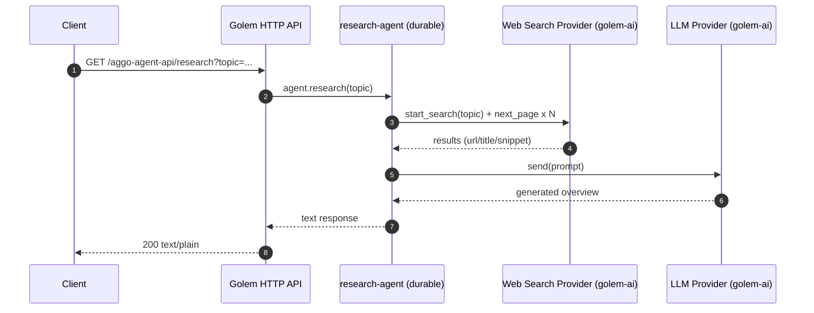

# aggo-agent

Durable “research agent” built with Golem Cloud + Rust.

This repo is a `golem app new`-style Rust workspace that compiles a WASM component, exposes an HTTP API, performs web search via a configurable provider, and asks an LLM to summarize the results.

## Background

Golem is an agent-native runtime for durable, stateful components. Instead of running a traditional server that you manage, you build a WASM component and Golem handles:

- Durable execution (transparent retries / recovery)
- Per-agent state and observability
- HTTP API routing into agent methods

This project demonstrates that workflow for a simple “research” capability.

## Scope (What this repo does)

- Exposes an HTTP endpoint that calls the agent method `research(topic)`
- Fetches a few pages of web results using `golem-ai` web search
- Sends a prompt (topic + snippets + URLs) to an LLM using `golem-ai` LLM bindings
- Returns a plain-text overview plus “best links”

Non-goals:

- UI, authentication, rate limiting
- Persistent knowledge base / vector store
- Tool orchestration beyond search + LLM

## Architecture

High-level request flow:



## Repo layout

- components-rust/aggo-agent/ : the main WASM component (agent implementation)
- common-rust/ : shared Golem “rust component template” configuration
- golem.yaml : app-level manifest (includes component manifests)
- .wit/ : WIT interface definitions and deps
- golem-temp/ : generated artifacts (wrappers, linked wasm, generated WIT)

## API

This repo defines an HTTP API in components-rust/aggo-agent/golem.yaml:

- Route: `GET /aggo-agent-api/research?topic=...`
- Response: `text/plain`

When running locally, it deploys to:

- `aggo-agent.localhost:9006`
- `aggo-agent-v2.localhost:9006`

Example:

```bash
curl "http://aggo-agent-v2.localhost:9006/aggo-agent-api/research?topic=durable%20agents"
```

## Development

### Prerequisites

- Rust via rustup
- WASI target: `rustup target add wasm32-wasip1`
- `cargo-component` (required because this repo builds with `cargo component build`)
- Golem CLI (with local server support)

### Configure providers

This project uses Golem AI provider WASM modules.

1) LLM provider

- By default, components-rust/aggo-agent/golem.yaml enables the Ollama LLM module:
    - `golem_llm_ollama.wasm`
- Configure:
    - `LLM_MODEL` (defaults to what’s in the manifest)
    - optionally `GOLEM_OLLAMA_BASE_URL` if your Ollama isn’t at `http://localhost:11434`

2) Web search provider

- By default, this repo is configured for Brave search.
- Set in components-rust/aggo-agent/golem.yaml:
    - `WEB_SEARCH_PROVIDER: brave`
    - `BRAVE_API_KEY: ...`

To switch providers:

- Change `WEB_SEARCH_PROVIDER` to one of: `brave | google | serper | tavily`
- Enable exactly one matching dependency under `dependencies:` in components-rust/aggo-agent/golem.yaml:
    - `golem_web_search_brave.wasm`
    - `golem_web_search_google.wasm`
    - `golem_web_search_serper.wasm`
    - `golem_web_search_tavily.wasm`
- Set the provider’s required API key env vars.

Note: DuckDuckGo is not currently exposed as a `golem-ai` web search provider in this repo’s dependency set; if you specifically need DuckDuckGo, you’d need a custom HTTP integration (not included here).

### Build

```bash
cargo component build
```

### Run locally

1) Start local Golem server:

```bash
golem server run
```

2) Deploy the app (local environment):

```bash
golem deploy --local -Y
```

3) If you changed the component or env, recreate the durable agents so they pick up the new revision:

```bash
golem redeploy-agents --local -Y
```

4) Call the HTTP API (see “API” section):

```bash
curl -sS -H "Host: aggo-agent-v2.localhost:9006" -H "Accept: text/plain" \
  "http://127.0.0.1:9006/aggo-agent-api/research?topic=rust%20wasm%20agent" -m 120
```

### Quick commands (build, deploy, test & verify) 🔧

- **Build the component**

```bash
cargo component build
```

- **Deploy to local environment**

```bash
golem deploy --local -Y
```

- **Recreate agents (apply code/env changes)**

```bash
golem redeploy-agents --local -Y
```

- **Invoke the agent and stream its logs** (note quoting to avoid shell parsing errors):

```bash
golem agent invoke 'aggo:agent/research-agent()' 'aggo:agent/research-agent.{research}' '"rust wasm agent"' --local --stream --logs-only
```

- **Stream agent logs**

```bash
golem agent stream 'aggo:agent/research-agent()' --local
```

- **Start local server (if not already running)**

```bash
golem server run
```

> **Tip:** Quote agent IDs containing parentheses (e.g., `'aggo:agent/research-agent()'`) to avoid shell errors. Include `-H "Accept: text/plain"` to request plain text responses from the HTTP API. Use `-Y` to auto-confirm deploy/redeploy prompts.

> **Note:** If you want to force a specific Ollama model for this component, set **`AGGO_LLM_MODEL`** in `components-rust/aggo-agent/golem.yaml` (the component prefers `AGGO_LLM_MODEL` over `LLM_MODEL`).

### Tests

```bash
cargo test
```

## Deployment (Cloud)

At a high level:

- Configure a Golem Cloud profile: `golem profile new` then `golem profile use ...`
- Deploy: `golem app deploy`
- Invoke via HTTP API (configure a deployment domain for cloud if needed)

Exact flags and profile setup depend on your CLI version and org setup.

## Troubleshooting

- “Failed to start web search … enabled the correct golem-ai web-search provider wasm”
    - Ensure you uncommented the correct `golem_web_search_*.wasm` dependency and set the matching API key env vars.
- If using Ollama:
    - Ensure Ollama is running and reachable from where your local Golem server executes.

### Oplog troubleshooting (durable execution)

Golem logs durable execution events (including external I/O) in the agent oplog. This is the first place to look when:

- a request is retried and you want to confirm it didn’t re-run external effects
- a provider call fails and you need the exact error payload
- you want to see what the agent did during recovery/replay

Common commands (local):

```bash
# List agents
golem agent list --local --component-name aggo:agent

# The agent used by this repo's HTTP route
AGENT_ID='aggo:agent/research-agent()'

# Stream logs for that agent
golem agent stream "$AGENT_ID" --local

# Dump oplog entries (use --from to page; can be large)
golem agent oplog --local "$AGENT_ID" --from 0

# Filter oplog entries with a Lucene query (substring-style queries work well)
golem agent oplog --local "$AGENT_ID" --query 'golem_websearch'
golem agent oplog --local "$AGENT_ID" --query 'golem_llm'
golem agent oplog --local "$AGENT_ID" --query 'brave search api'
```

#### Inspect the durable Brave web-search results (from oplog)

The web search in this repo is executed via the durable `golem-ai` web-search module. That means the external I/O is recorded in the agent oplog, including the returned result set.

1) Invoke once (via HTTP):

```bash
curl -sS -H "Host: aggo-agent-v2.localhost:9006" -H "Accept: text/plain" \
  "http://127.0.0.1:9006/aggo-agent-api/research?topic=brave%20search%20api" -m 180
```

2) Dump only the recorded web-search page fetches (`next_page`) to a file:

```bash
AGENT_ID='aggo:agent/research-agent()'

# IMPORTANT: don't pipe `golem ... --format json` into `head` (some CLI versions can crash on broken pipe).
golem agent oplog --local --format json "$AGENT_ID" --query 'golem_websearch AND next_page' > /tmp/aggo_websearch_oplog.jsonl
```

3) Extract and print the first few URLs from the logged responses:

```bash
python3 - <<'PY'
import json
from pathlib import Path

p = Path('/tmp/aggo_websearch_oplog.jsonl')

# `--format json` is emitted as newline-delimited JSON chunks.
# Each line is usually like: [[<op_index>, { ...entry... }], ...]
entries = []
for line in p.read_text(encoding='utf-8', errors='replace').splitlines():
    line = line.strip()
    if not line:
        continue
    entries.extend(json.loads(line))

def iter_results(entry):
    # For `golem_websearch::next_page`, the response is a WIT-encoded Result.
    # In practice it looks like: response.value.ok[0] == list of result objects
    resp = entry.get('response') or {}
    value = resp.get('value') or {}
    ok = value.get('ok') if isinstance(value, dict) else None
    if not (isinstance(ok, list) and ok):
        return
    results = ok[0]
    if not isinstance(results, list):
        return
    for r in results:
        if isinstance(r, dict):
            yield r

for op_index, entry in entries:
    if entry.get('functionName') != 'golem_websearch::next_page':
        continue
    print(f'=== oplog op_index={op_index} ===')
    for r in list(iter_results(entry))[:5]:
        print('-', r.get('title'), '|', r.get('url'))
PY
```

Notes:

- The oplog is a **durable execution log**; treat it as sensitive. Depending on provider implementations, it may include request metadata that you do not want to share publicly.
- If you need to narrow down to a specific run, query by the topic string (it appears in the agent invocation and output), then re-run with `--from <index>` around that match to inspect nearby entries.

#### Prove durability: idempotency + replay of Brave results

There are two practical “proofs” you can do locally:

1) **Idempotency proof**: invoking the same agent method again with the same idempotency key should **not** re-run the external Brave search; it should reuse the already-recorded results.

2) **Crash/recovery proof** (optional): simulate a crash and observe that the agent recovers and continues using recorded external results.

##### 1) Idempotency proof (recommended)

This is the most repeatable demo because it doesn’t rely on timing.

```bash
AGENT_ID='aggo:agent/research-agent()'
TOPIC='durability-proof-brave'
IDEMPOTENCY_KEY='durability-proof-brave-1'

# Capture a baseline count of logged Brave page fetches
golem agent oplog --local --format json "$AGENT_ID" --query 'golem_websearch AND next_page' > /tmp/oplog_before.jsonl

# First invocation (executes Brave search + logs results durably)
golem agent invoke --local \
    --idempotency-key "$IDEMPOTENCY_KEY" \
    "$AGENT_ID" \
    'aggo:agent/research-agent.{research}' \
    '"'"$TOPIC"'"'

# Second invocation with the same idempotency key (should reuse the same durable outcome)
golem agent invoke --local \
    --idempotency-key "$IDEMPOTENCY_KEY" \
    "$AGENT_ID" \
    'aggo:agent/research-agent.{research}' \
    '"'"$TOPIC"'"'

# Compare oplog: if durability is working, you should not see new Brave `next_page` entries on the second call.
golem agent oplog --local --format json "$AGENT_ID" --query 'golem_websearch AND next_page' > /tmp/oplog_after.jsonl

python3 - <<'PY'
import json
from pathlib import Path

def count_next_page(path: str) -> int:
        entries=[]
        for line in Path(path).read_text(encoding='utf-8', errors='replace').splitlines():
                line=line.strip()
                if not line:
                        continue
                entries.extend(json.loads(line))
        return sum(1 for _,e in entries if e.get('functionName')=='golem_websearch::next_page')

before=count_next_page('/tmp/oplog_before.jsonl')
after=count_next_page('/tmp/oplog_after.jsonl')
print('next_page_entries_before', before)
print('next_page_entries_after ', after)
print('delta', after - before)
PY
```

Interpretation:

- If `delta` is `0`, the second invocation did not add new Brave page fetches — it reused durable results.
- If `delta` increases, your second call likely did a fresh invocation (most commonly because the idempotency key differed).

##### 2) Crash + recovery proof (optional)

This simulates a worker crash and immediate recovery. You can use oplog inspection to confirm the external `golem_websearch` calls are still present and the agent continues after recovery.

```bash
AGENT_ID='aggo:agent/research-agent()'

# Start streaming logs in one terminal
golem agent stream --local "$AGENT_ID"

# In another terminal, trigger an invocation, then simulate a crash
golem agent invoke --local --trigger "$AGENT_ID" 'aggo:agent/research-agent.{research}' '"crash-proof-brave"'
golem agent simulate-crash --local "$AGENT_ID"

# Inspect oplog around web search
golem agent oplog --local "$AGENT_ID" --query 'golem_websearch'
```

What to look for:

- **External I/O**: web search + LLM calls show up as external operations. On replay, Golem should reuse the logged results instead of re-issuing the call.
- **Durable state changes**: if/when an agent method mutates its internal component state, those mutations are recorded and will appear in the oplog (search for "state").

Tip: if you’re debugging recovery behavior, keep one terminal running:

```bash
golem agent stream 'aggo:agent/research-agent()' --local
```

and in another terminal invoke:

```bash
golem agent invoke 'aggo:agent/research-agent()' 'aggo:agent/research-agent.{research}' '"durable agents"' --local --stream --logs-only
```
