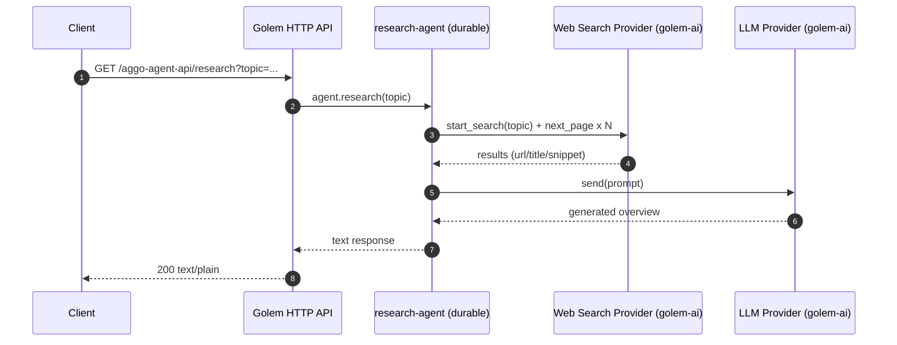

# aggo-agent

Durable “research agent” built with Golem Cloud + Rust.

This repo is a `golem app new`-style Rust workspace that compiles a WASM component, exposes an HTTP API, performs web search via a configurable provider, and asks an LLM to summarize the results.

## Background

Golem is an agent-native runtime for durable, stateful components. Instead of running a traditional server that you manage, you build a WASM component and Golem handles:

- Durable execution (transparent retries / recovery)
- Per-agent state and observability
- HTTP API routing into agent methods

This project demonstrates that workflow for a simple “research” capability.

## Scope (What this repo does)

- Exposes an HTTP endpoint that calls the agent method `research(topic)`
- Fetches a few pages of web results using `golem-ai` web search
- Sends a prompt (topic + snippets + URLs) to an LLM using `golem-ai` LLM bindings
- Returns a plain-text overview plus “best links”

Non-goals:

- UI, authentication, rate limiting
- Persistent knowledge base / vector store
- Tool orchestration beyond search + LLM

## Architecture

High-level request flow:



## Repo layout

- components-rust/aggo-agent/ : the main WASM component (agent implementation)
- common-rust/ : shared Golem “rust component template” configuration
- golem.yaml : app-level manifest (includes component manifests)
- .wit/ : WIT interface definitions and deps
- golem-temp/ : generated artifacts (wrappers, linked wasm, generated WIT)

## API

This repo defines an HTTP API in components-rust/aggo-agent/golem.yaml:

- Route: `GET /aggo-agent-api/research?topic=...`
- Response: `text/plain`

When running locally, it deploys to:

- `aggo-agent.localhost:9006`

Example:

```bash
curl "http://aggo-agent.localhost:9006/aggo-agent-api/research?topic=durable%20agents"
```

## Development

### Prerequisites

- Rust via rustup
- WASI target: `rustup target add wasm32-wasip1`
- `cargo-component` (required because this repo builds with `cargo component build`)
- Golem CLI (with local server support)

### Configure providers

This project uses Golem AI provider WASM modules.

1) LLM provider

- By default, components-rust/aggo-agent/golem.yaml enables the Ollama LLM module:
    - `golem_llm_ollama.wasm`
- Configure:
    - `LLM_MODEL` (defaults to what’s in the manifest)
    - optionally `GOLEM_OLLAMA_BASE_URL` if your Ollama isn’t at `http://localhost:11434`

2) Web search provider

- By default, this repo is configured for Brave search.
- Set in components-rust/aggo-agent/golem.yaml:
    - `WEB_SEARCH_PROVIDER: brave`
    - `BRAVE_API_KEY: ...`

To switch providers:

- Change `WEB_SEARCH_PROVIDER` to one of: `brave | google | serper | tavily`
- Enable exactly one matching dependency under `dependencies:` in components-rust/aggo-agent/golem.yaml:
    - `golem_web_search_brave.wasm`
    - `golem_web_search_google.wasm`
    - `golem_web_search_serper.wasm`
    - `golem_web_search_tavily.wasm`
- Set the provider’s required API key env vars.

Note: DuckDuckGo is not currently exposed as a `golem-ai` web search provider in this repo’s dependency set; if you specifically need DuckDuckGo, you’d need a custom HTTP integration (not included here).

### Build

```bash
cargo component build
```

### Run locally

1) Start local Golem server:

```bash
golem server run
```

2) Deploy the app (local environment):

```bash
golem deploy --local -Y
```

3) If you changed the component or env, recreate the durable agents so they pick up the new revision:

```bash
golem redeploy-agents --local -Y
```

4) Call the HTTP API (see “API” section):

```bash
curl -sS -H "Host: aggo-agent.localhost:9006" -H "Accept: text/plain" \
  "http://127.0.0.1:9006/aggo-agent-api/research?topic=rust%20wasm%20agent" -m 120
```

### Quick commands (build, deploy, test & verify) 🔧

- **Build the component**

```bash
cargo component build
```

- **Deploy to local environment**

```bash
golem deploy --local -Y
```

- **Recreate agents (apply code/env changes)**

```bash
golem redeploy-agents --local -Y
```

- **Invoke the agent and stream its logs** (note quoting to avoid shell parsing errors):

```bash
golem agent invoke 'aggo:agent/research-agent()' 'aggo:agent/research-agent.{research}' '"rust wasm agent"' --local --stream --logs-only
```

- **Stream agent logs**

```bash
golem agent stream 'aggo:agent/research-agent()' --local
```

- **Start local server (if not already running)**

```bash
golem server run
```

> **Tip:** Quote agent IDs containing parentheses (e.g., `'aggo:agent/research-agent()'`) to avoid shell errors. Include `-H "Accept: text/plain"` to request plain text responses from the HTTP API. Use `-Y` to auto-confirm deploy/redeploy prompts.

> **Note:** If you want to force a specific Ollama model for this component, set **`AGGO_LLM_MODEL`** in `components-rust/aggo-agent/golem.yaml` (the component prefers `AGGO_LLM_MODEL` over `LLM_MODEL`).

### Tests

```bash
cargo test
```

## Deployment (Cloud)

At a high level:

- Configure a Golem Cloud profile: `golem profile new` then `golem profile use ...`
- Deploy: `golem app deploy`
- Invoke via HTTP API (configure a deployment domain for cloud if needed)

Exact flags and profile setup depend on your CLI version and org setup.

## Troubleshooting

- “Failed to start web search … enabled the correct golem-ai web-search provider wasm”
    - Ensure you uncommented the correct `golem_web_search_*.wasm` dependency and set the matching API key env vars.
- If using Ollama:
    - Ensure Ollama is running and reachable from where your local Golem server executes.
